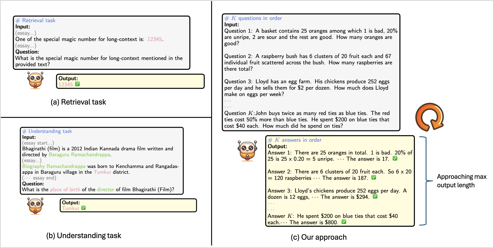

<h1 align="center">
   🚀 EMNLP 2024 Findings 📃 
   <a href="https://arxiv.org/abs/2410.04199" target="_blank">Paper</a>
</h1>

# 📖 LongGenBench: Long-context Generation Benchmark


## Overview

**LongGenBench** is a newly introduced benchmark specifically designed to evaluate the long-context generation capabilities of large language models (LLMs). Unlike traditional retrieval-based benchmarks, LongGenBench focuses on the ability of models to generate coherent and contextually accurate text over extended passages. It allows for customizable generation context lengths and requires LLMs to respond with a single, cohesive long-context answer. Key findings from LongGenBench evaluations include:

1. Both API-accessed and open-source models experience performance degradation in long-context generation, ranging from 1.2% to 47.1%.
2. Different LLM series show varying trends of performance degradation, with the Gemini-1.5-Flash model showing the least degradation among API models, and the Qwen2 series performing best among open-source models.

## Method


## ⚙️ How to evaluate on LongGenBench
```
conda create -yn LongGenBench python=3.9 
conda activate LongGenBench
pip install -r requirements.txt
```

Replace the API key with your own API key in the bash file.

### 📚 GSM8K

```
bash run_longgenbench_GSM8K.sh
```


### 📚 MMLU

```
bash run_longgenbench_MMLU.sh
```
The each subtask of MMLU will run fist K questions and then output the result to the `./outputs/LongGenBench_MMLU/LongGenBench_MMLU_{subtask_name}.txt`


## 📚 Bibtex
If you use or extend our work, please cite the following [paper](https://arxiv.org/abs/2410.04199):
```
@misc{liu2024longgenbench,
      title={LongGenBench: Long-context Generation Benchmark}, 
      author={Xiang Liu and Peijie Dong and Xuming Hu and Xiaowen Chu},
      year={2024},
      eprint={2410.04199},
      archivePrefix={arXiv},
      primaryClass={cs.CL},
      url={https://arxiv.org/abs/2410.04199}, 
}


```

## 📚 Acknowledgement

We would like to thank the authors of [Active-Prompt](https://github.com/shizhediao/active-prompt) and [Chain-of-Thought-Hub](https://github.com/FranxYao/chain-of-thought-hub/) for providing the codebase.

